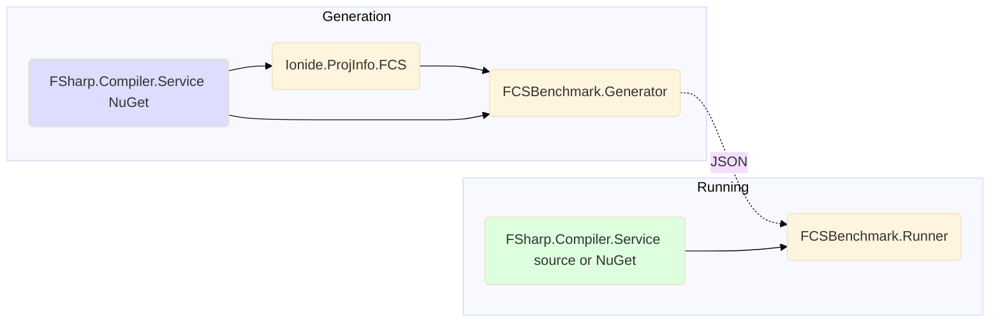
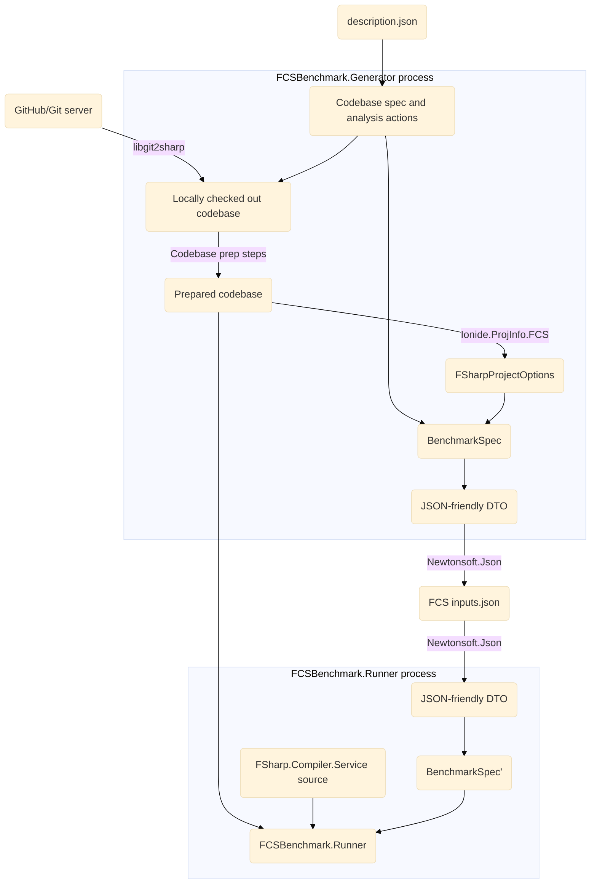

# FCSBenchmark.Generator

## What is it
A command-line app for generating and running benchmarks of FCS using high-level analysis definitions

Its goal is to make it easy to run FCS benchmarks that are:
* high-level
* using real, publicly-available codebase examples
* reproducible

## How it works
### Dependency graph
Below chart describes dependencies of the two main components - generator and runner.

Note that the generator is completely independent from the runner, including having different FCS references. 

### Process steps graph
Below chart describes the steps performed during a benchmark run and their dependencies, including any preparation steps

## Installation
Benchmark can be installed as a dotnet global tool using the following command:
```bash
dotnet tool install --global FCSBenchmark --prerelease
```
Then run using the `fcs-benchmark` executable.
## How to use it
To run a benchmark you need a benchmark definition.
Sample definitions can be found in `inputs/`.
As an example, you can download a [Fantomas](https://github.com/fsprojects/fantomas) benchmark - `inputs/fantomas.json` - using the following PowerShell command:
```powershell
Invoke-WebRequest -Uri https://raw.githubusercontent.com/safesparrow/fsharp-benchmark-generator/main/inputs/fantomas.json -OutFile input_fantomas.json
```
Below command runs `FCSBenchmark.Generator` against the above definition using 3 different FCS versions: 
```bash
fcs-benchmark -i input_fantomas.json --official 41.0.5 41.0.2 --local c:\projekty\fsharp\fsharp_main -n 1 
```
Let's deconstruct it:
- `dotnet run -c Release --project ./FCSBenchmark.Generator.fsproj` - boilerplate required to start the program
- ` -- ` - indicates that the following arguments should be forwarded to the app rather than consumed by `dotnet`
- `-i .\inputs\fantomas.json` - points to a benchmark definition
- `--official 41.0.5 41.0.2` - specifies two FCS versions to be, available on public NuGet feed
- `--local c:\projekty\fsharp\fsharp_main` - specifies one local version of FCS to use, by pointing to a repository root - this assumes FCS has been packed using `./build.cmd -pack ...` command
For more CLI options use `dotnet run --help`

<details>
<summary>Sample output:</summary>

```bash
[23:55:02 INF] PrepareCodebase: Preparing repo fantomas (https://github.com/fsprojects/fantomas) @ 0fe6785076e045f28e4c88e6a57dd09b649ce671
[23:55:02 INF] PrepareCodebase: .artifacts\fantomas\0fe6785076e045f28e4c88e6a57dd09b649ce671 already exists - will assume the correct repository is already checked out
[23:55:02 INF] PrepareCodebase: Running 3 codebase prep steps
[23:55:05 INF] LoadOptions: 7 projects loaded from C:\projekty\fsharp\fsharp-benchmark-generator\.artifacts\fantomas\0fe6785076e045f28e4c88e6a57dd09b649ce671\fantomas.sln
[23:55:05 INF] PrepareAndRun: Serializing inputs as C:\projekty\fsharp\fsharp-benchmark-generator\.artifacts\fantomas\0fe6785076e045f28e4c88e6a57dd09b649ce671\.artifacts\2022-08-24_22-55-05.fcsinputs.json
[23:55:05 INF] Run: Starting the benchmark:
- Full BDN output can be found in C:\projekty\fsharp\fsharp-benchmark-generator\bin\Release\net6.0\FCSBenchmark.Runner\BenchmarkDotNet.Artifacts/*.log.
- Full commandline: 'dotnet run -c Release -- --input=C:\projekty\fsharp\fsharp-benchmark-generator\.artifacts\fantomas\0fe6785076e045f28e4c88e6a57dd09b649ce671\.artifacts\2022-08-24_22-55-05.fcsinputs.json --iterations=2 --warmups=1 --official 41.0.5 41.0.2 --local c:\projekty\fsharp\fsharp_main'
- Working directory: 'C:\projekty\fsharp\fsharp-benchmark-generator\bin\Release\net6.0\FCSBenchmark.Runner'.
[23:58:10 INF] Run:
[23:58:10 INF] Run: BenchmarkDotNet=v0.13.1, OS=Windows 10.0.22621
[23:58:10 INF] Run: AMD Ryzen 7 5700G with Radeon Graphics, 1 CPU, 16 logical and 8 physical cores
[23:58:10 INF] Run:   [Host]                         : .NET Framework 4.8 (4.8.9075.0), X64 LegacyJIT DEBUG
[23:58:10 INF] Run:   41.0.2                         : .NET Framework 4.8 (4.8.9075.0), X64 RyuJIT
[23:58:10 INF] Run:   41.0.5                         : .NET Framework 4.8 (4.8.9075.0), X64 RyuJIT
[23:58:10 INF] Run:   c:\projekty\fsharp\fsharp_main : .NET Framework 4.8 (4.8.9075.0), X64 RyuJIT
[23:58:10 INF] Run:
[23:58:10 INF] Run: EnvironmentVariables=FcsBenchmarkInput=C:\projekty\fsharp\fsharp-benchmark-generator\.artifacts\fantomas\0fe6785076e045f28e4c88e6a57dd09b649ce671\.artifacts\2022-08-24_22-55-05.fcsinputs.json  InvocationCount=1  IterationCount=2
[23:58:10 INF] Run: LaunchCount=1  UnrollFactor=1  WarmupCount=1
[23:58:10 INF] Run:
[23:58:10 INF] Run: | Method |                            Job |                                  NuGetReferences |    Mean | Error |  StdDev |       Gen 0 |       Gen 1 |     Gen 2 | Allocated |
[23:58:10 INF] Run: |------- |------------------------------- |------------------------------------------------- |--------:|------:|--------:|------------:|------------:|----------:|----------:|
[23:58:10 INF] Run: |    Run |                         41.0.2 | FSharp.Compiler.Service 41.0.2,FSharp.Core 6.0.2 | 10.23 s |    NA | 0.256 s | 692000.0000 | 134000.0000 | 7000.0000 |      4 GB |
[23:58:10 INF] Run: |    Run |                         41.0.5 | FSharp.Compiler.Service 41.0.5,FSharp.Core 6.0.5 | 10.22 s |    NA | 0.145 s | 704000.0000 | 140000.0000 | 7000.0000 |      4 GB |
[23:58:10 INF] Run: |    Run | c:\projekty\fsharp\fsharp_main | FSharp.Compiler.Service 41.0.6,FSharp.Core 6.0.6 | 10.75 s |    NA | 0.547 s | 698000.0000 | 137000.0000 | 7000.0000 |      4 GB |
[23:58:10 INF] Run: Full Log available in 'C:\projekty\fsharp\fsharp-benchmark-generator\bin\Release\net6.0\FCSBenchmark.Runner\BenchmarkDotNet.Artifacts\FCSBenchmark.Runner.FCSBenchmark-20220824-235509.log'
[23:58:10 INF] Run: Reports available in 'C:\projekty\fsharp\fsharp-benchmark-generator\bin\Release\net6.0\FCSBenchmark.Runner\BenchmarkDotNet.Artifacts\results'
```

</details>

## Benchmark description format
The benchmark description is a high-level definition of code analysis that we want to benchmark. It consists of two parts:
- a codebase to be analysed
- specific analysis actions (eg. analyse file `A.fs` in project `B`)

[inputs/](inputs/) directory contains existing samples.

Let's look at [inputs/fantomas.json](inputs/fantomas.json):
```json5
// Checkout a revision of Fantomas codebase and perform a single analysis action on the top-level file
{
  // Repository to checkout as input for code analysis benchmarking
  "Repo": {
    // Short name used for determining local checkout directory
    "Name": "fantomas",
    // Full URL to a publicy-available Git repository
    "GitUrl": "https://github.com/fsprojects/fantomas",
    // Revision to use for 'git checkout' - using a commit hash rather than a branch/tag name guarantees reproducability
    "Revision" : "724087e0ffe09c6e1db040fe81b9986d90be8cc6"
  },
  // Commands required to prepare a checked out codebase for code inspection with Ionide.ProjInfo
  // If not specified, defaults to a single `dotnet restore %slnpath%` command.
  "CodebasePrep": [
    {
      "Command": "dotnet",
      "Args": "tool restore"
    },
    {
      "Command": "dotnet",
      "Args": "paket restore"
    }
  ],
  // Solution to open relative to the repo's root - all projects in the solution will be available in action definitions below
  "SlnRelative": "fantomas.sln",
  // A sequence of actions to be performed by FCS on the above codebase
  "CheckActions": [
    // Analyse DaemonTests.fs in the project named Fantomas.Tests
    {
      "FileName": "Integration/DaemonTests.fs",
      // This is a project name only - not project file's path (we currently assume names are unique)
      "ProjectName": "Fantomas.Tests",
      // Run this action once
      "Repeat": 1
    }
  ]
}
```
#### Local codebase analysis benchmarks
Only for local testing purposes a benchmark can point to a local codebase to be analysed instead of a publicly available GitHub repo.

Since the specification provides no guarantees about the local codebase's contents, this mode should not be used for comparing results between machines/users (even if the same code is available locally on multiple machines).

See an example from [inputs/local_example.json](inputs/local_example.json): 
```json5
{
  // Path to the locally available codebase
  "LocalCodeRoot": "Path/To/Local/Code/Root",
  // The rest of the options are the same
  "SlnRelative": "solution.sln",
  "CheckActions": [
    {
      "FileName": "library.fs",
      "ProjectName": "root"
    }
  ]
}
```

## Known limitations
* For local FCS versions the FCS needs to be published (locally) by running `./build.cmd -noVisualStudio -pack` before the benchmark
* Depends on having the correct MSBuild/Dotnet setup available on the machine
* At the moment supports only one type of action (analysis of a file in a project)
