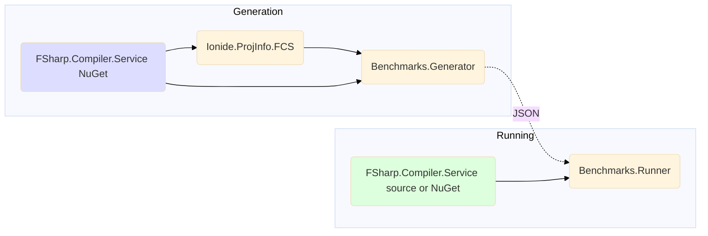
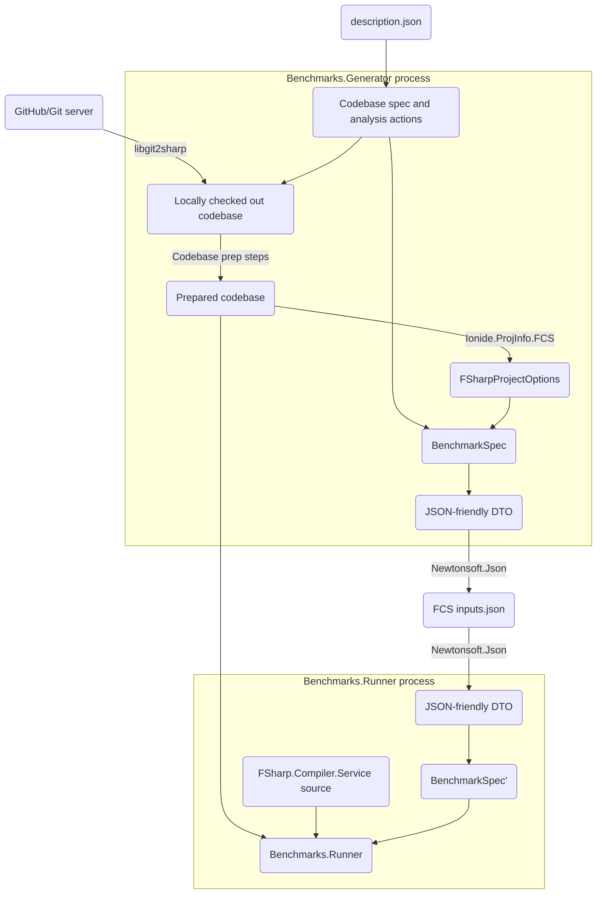

# Benchmarks.Generator

## What is it
A command-line app for generating and running benchmarks of FCS using high-level analysis definitions

Its goal is to make it easy to run FCS benchmarks that are:
* high-level
* using real, publicly-available codebase examples
* reproducible

## How it works
### Dependency graph
Below chart describes dependencies of the two main components - generator and runner.

Note that the generator is completely independent from the runner, including having different FCS references. 

### Process steps graph
Below chart describes the steps performed during a benchmark run and their dependencies, including any preparation steps

## How to use it
### Run `Benchmark.Generator` to generate and run the benchmark
```bash
dotnet run -i inputs/50_leaves.json 
```
For more CLI options use `dotnet run --help`

<details>
<summary>Sample output:</summary>

```bash
[13:17:58 INF] PrepareCodebase: Preparing repo 50_leaves - https://github.com/safesparrow/fsharp-samples at revision 744ada94e1fffda8d622f817f6b7642a0d17e4f0
[13:17:58 INF] PrepareCodebase: .artifacts\50_leaves\744ada94e1fffda8d622f817f6b7642a0d17e4f0 already exists - will assume the correct repository is already checked out
[13:17:58 INF] PrepareCodebase: Running 1 codebase prep steps
[13:18:06 INF] LoadOptions: 51 projects loaded from D:\projekty\ftest\fsharp-benchmark-generator\.artifacts\50_leaves\744ada94e1fffda8d622f817f6b7642a0d17e4f0\50_leaves/solution.sln
[13:18:06 INF] PrepareAndRun: Serializing inputs as D:\projekty\ftest\fsharp-benchmark-generator\.artifacts\50_leaves\744ada94e1fffda8d622f817f6b7642a0d17e4f0\.artifacts\2022-07-23_12-18-06.fcsinputs.json
[13:18:06 INF] Run: Starting the benchmark
[13:18:06 INF] Run: Deserializing inputs from 'D:\projekty\ftest\fsharp-benchmark-generator\.artifacts\50_leaves\744ada94e1fffda8d622f817f6b7642a0d17e4f0\.artifacts\2022-07-23_12-18-06.fcsinputs.json'
[13:18:07 INF] Run: Running 1 iteration(s) of the benchmark, each containing 1 action(s)
[13:18:07 INF] Run: [0] Action: start
[13:18:25 INF] Run: 0 diagnostics calculated:
[13:18:25 INF] Run: [0] Action: took 17925ms
[13:18:25 INF] Run: Performed 1 action(s) in 17925ms
[13:18:25 INF] Run: Performed 1 iteration(s) in 17925 - averaging 17925ms per iteration
```

</details>

## Benchmark description format
The benchmark description is a high-level definition of code analysis that we want to benchmark. It consists of two parts:
- a codebase to be analysed
- specific analysis actions (eg. analyse file `A.fs` in project `B`)

[inputs/](inputs/) directory contains existing samples.

Let's look at [inputs/fantomas.json](inputs/fantomas.json):
```json5
// Checkout a revision of Fantomas codebase and perform a single analysis action on the top-level file
{
  // Repository to checkout as input for code analysis benchmarking
  "Repo": {
    // Short name used for determining local checkout directory
    "Name": "fantomas",
    // Full URL to a publicy-available Git repository
    "GitUrl": "https://github.com/fsprojects/fantomas",
    // Revision to use for 'git checkout' - using a commit hash rather than a branch/tag name guarantees reproducability
    "Revision" : "724087e0ffe09c6e1db040fe81b9986d90be8cc6"
  },
  // Commands to run to prepare a checked out codebase for `dotnet run`
  "CodebasePrep": [
    {
      "Command": "dotnet",
      "Args": "tool restore"
    },
    {
      "Command": "dotnet",
      "Args": "paket restore"
    }
  ],
  // Solution to open relative to the repo's root - all projects in the solution will be available in action definitions below
  "SlnRelative": "fantomas.sln",
  // A sequence of actions to be performed by FCS on the above codebase
  "CheckActions": [
    // Analyse DaemonTests.fs in the project named Fantomas.Tests
    {
      "FileName": "Integration/DaemonTests.fs",
      // This is a project name only - not project file's path (we currently assume names are unique)
      "ProjectName": "Fantomas.Tests"
    }
  ]
}
```
#### Local codebase
For local testing only a local codebase can be used instead of a publicly available GitHub repo.

Since the specification provides no guarantees about the local codebase's contents, this mode should not be used for comparing results between machines/users (even if the same code is available locally on multiple machines).

See an example from [inputs/local_example.json](inputs/local_example.json): 
```json5
{
  // Path to the locally available codebase
  "LocalCodeRoot": "Path/To/Local/Code/Root",
  // The rest of the options are the same
  "SlnRelative": "solution.sln",
  "CheckActions": [
    {
      "FileName": "library.fs",
      "ProjectName": "root"
    }
  ]
}
```

## Known issues
* Benchmark assumes that the FSharp.Compiler.Service has already been built
* Only `Release` configuration is supported
* Currently BenchmarkDotNet is not used
* Little customization of the actual benchmark's environment
* Depends on having the correct MSBuild/Dotnet setup available
